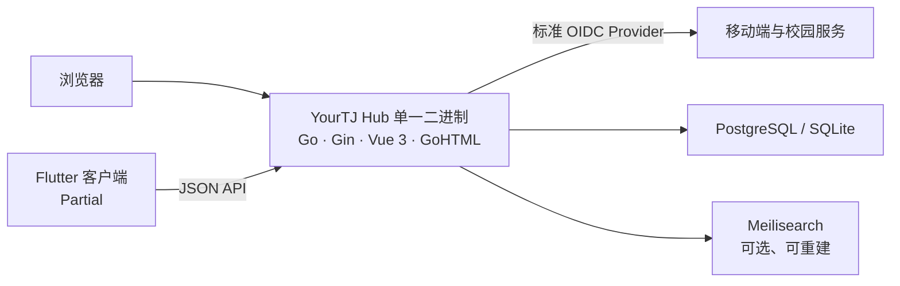

<p align="center">
  
</p>

<h1 align="center">YourTJ Hub</h1>

<p align="center">
  面向同济校园的社区平台，以论坛沉淀长期有价值的信息与讨论。<br>
  <sub>A community platform for Tongji University, built around durable, searchable conversations.</sub>
</p>

<p align="center">
  <a href="https://github.com/YourTongji/YourTJ-Hub/actions/workflows/ci-backend.yml"></a>
  <a href="https://github.com/YourTongji/YourTJ-Hub/actions/workflows/ci-frontend.yml"></a>
  <a href="https://github.com/YourTongji/YourTJ-Hub/actions/workflows/ci-mobile.yml"></a>
  <a href="https://github.com/YourTongji/YourTJ-Hub/actions/workflows/ci-contract.yml"></a>
  <a href="https://github.com/YourTongji/YourTJ-Hub/releases"></a>
</p>

<p align="center">
  <a href="https://forum.yourtj.de">线上站点</a> ·
  <a href="./docs/README.md">项目文档</a> ·
  <a href="https://github.com/YourTongji/YourTJ-Hub/issues/new?template=bug-report.yml">报告问题</a> ·
  <a href="https://github.com/YourTongji/YourTJ-Hub/issues/new?template=feature-request.yml">功能建议</a> ·
  <a href="./CONTRIBUTING.md">贡献指南</a>
</p>

## 关于项目

YourTJ Hub 希望让校园经验、问题与观点不再消失在短暂的信息流中。项目以板块化论坛为核心，
提供搜索、统一身份、内容治理和多端访问能力，并为未来的课程、课评等校园服务保留共享基础设施。

核心论坛直接演进自 [GooseForum](https://github.com/YourTongji/YourTJ-Hub/tree/main/apps/gooseforum)（fork 自上游
[leancodebox/GooseForum](https://github.com/leancodebox/GooseForum)），保留 Go 后端、Vue 前端
与 GoHTML 模板打包进同一个可执行文件的部署方式。这里不是对上游的薄包装：产品、认证、搜索、
数据、移动端与运维能力都在本仓库中持续演进，同时保留可合并上游更新的代码结构。

> 本项目仍在积极开发。下表中的 `Current`、`Partial`、`Planned` 是严格的实现状态，定义与完整缺口
> 见[当前状态](./docs/product/current-state.md)。

## 能力状态

| 领域 | 状态 | 当前能力 |
|---|---|---|
| 论坛 | `Current` | 主题与回复、板块、通知、私信、草稿、Markdown、RBAC 管理与多语言界面 |
| 身份与安全 | `Partial` | 密码、GitHub OAuth、论坛内建 OIDC Provider、TOTP 2FA、可撤销会话；移动端与外部服务可使用标准授权码 + PKCE 登录 |
| 搜索 | `Partial` | Meilisearch 聚合搜索、拼音匹配与事件驱动索引；搜索服务为可选依赖 |
| 数据与文件 | `Current` | 部署默认 PostgreSQL，本地开发 SQLite；文件可存于 SQLite BLOB 或 S3 兼容对象存储 |
| 内容治理 | `Current` | 敏感词审核、限流与验证码、审计、服务条款、数据导入导出 |
| 移动端 | `Partial` | Flutter 客户端、共享设计语言与 OIDC 登录已实现，尚未发布到应用商店 |
| API 契约 | `Partial` | OpenAPI 校验、TypeScript 生成与契约测试已落地，尚未覆盖全部接口 |
| 积分 | `Planned` | 跨服务积分模型尚未提供可用实现 |

## 架构



项目遵循四个重要约束：

- **单一二进制**：Vue 构建产物与 GoHTML 模板通过 `go:embed` 进入 Go 可执行文件，生产环境不拆分前后端。
- **数据库是真相源**：搜索索引、缓存和计数都是可重建投影，不承载唯一业务事实。
- **身份可互操作**：论坛 `users` 表是身份真相源，内建 OIDC Provider 对外签发数值型 `sub`。
- **上游可同步**：`apps/gooseforum` 保留 GooseForum 的主要分层；Go module 路径为本仓库地址，
  合并上游后需重写其 import 前缀（见 `AGENTS.md`）。

详细的领域边界、关键数据流和契约规则见[系统架构](./docs/architecture/system-overview.md)。

## 技术栈

| 范围 | 技术 |
|---|---|
| 后端 | Go 1.26、Gin、GORM、Cobra |
| Web | Vue 3、TypeScript、Vite、Tailwind CSS、GoHTML |
| Mobile | Flutter、Dart、Melos、Riverpod |
| 数据 | PostgreSQL、SQLite、Meilisearch |
| 身份 | 内建 OIDC Provider、GitHub OAuth、JWT、TOTP |
| 交付 | `go:embed` 单一二进制、Docker Compose、GitHub Actions |

## 快速开始

需要 Go 1.26+。开发 Web 界面还需要 Node.js 24 与 pnpm 11；运行 Meilisearch 或
PostgreSQL 等本地依赖时需要 Docker Compose。

```bash
git clone --branch dev https://github.com/YourTongji/YourTJ-Hub.git
cd YourTJ-Hub

cd apps/gooseforum/resource
pnpm install --frozen-lockfile
cd ../../..
```

分别启动后端与前端开发服务器：

```bash
# Terminal 1 — Go backend，默认 http://localhost:5234
make server

# Terminal 2 — Vite，打开 http://localhost:3010
make web
```

论坛默认使用 SQLite；首次启动会生成已被 Git 忽略的 `apps/gooseforum/config.toml`。如需搜索、
PostgreSQL 与其他本地依赖，可先运行：

```bash
make dev
```

构建生产形态的单一二进制：

```bash
make build
# output: bin/yourtj-hub
```

不要提交 `config.toml`，其中包含签名密钥和第三方服务凭据。完整配置、服务地址与移动端启动方式
见[本地开发指南](./docs/development/local-development.md)。

## 仓库结构

```text
apps/
  gooseforum/       Go + Vue 论坛，前端最终嵌入后端二进制
  mobile/           Flutter / Melos 移动端工作区
packages/
  api-contract/     OpenAPI、fixtures 与生成脚本
services/           Meilisearch、归档 Casdoor 配置、积分等服务配置
deploy/             容器、环境与发布脚本
docs/               产品、架构、开发和运维文档
```

业务逻辑、数据访问和 HTTP 层分别位于 `apps/gooseforum/app/service`、`app/models` 与
`app/http/controllers`。完整边界规则见 [`AGENTS.md`](./AGENTS.md)。

## Agent Skills

项目级 Agent Skill 位于 `.agents/skills/`，可在请求中显式引用：

- `$forum-ai-readable-content`：按需使用论坛公开的 `/llms.txt`、`/llms-full.txt`、`/p/posts/{id}.md`
  和经用户明确授权的 `/api/v1/agent` Agent Bot API，用于主题总结、内容审计、跨主题比较、事实提取、追问生成、
  证据化问答以及受控的 Agent 读写操作。Skill 不绕过 `404`、权限、审核、删除或限流边界；Agent token 只能通过
  宿主的安全凭据机制使用，不能写入普通回答；全文导出出现截断时必须标注覆盖不完整。可复制命令见
  `.agents/skills/forum-ai-readable-content/examples.md`；其中的 `scripts/` 仅使用 Python 标准库，默认只读，
  不接受命令行 token，也不实现 Webhook 发送或权限绕过。
- `$yourtj-development`：处理本仓库代码、文档、测试、发布和 PR 时使用，统一层边界与验证要求。

使用 AI 可读内容 Skill 时，匿名请求优先从索引定位主题，再按需读取单篇 Markdown；不要默认抓取全文或扩散无关的
个人信息。需要 Agent API 时，必须同时核对 Bearer Token、响应 envelope、写入限流和 Webhook 当前未实现边界。
公开导出规则的维护事实源是 `apps/gooseforum/app/service/llmsservice/`、相关 HTTP 路由测试和
`docs/architecture/contracts-and-data.md`；Agent Bot 规则的维护事实源是 `agentservice`、Agent 路由/契约测试、
`packages/api-contract/paths/agent.yaml` 和 `docs/product/identity-and-access.md`。

## 文档

[`docs/README.md`](./docs/README.md) 是唯一文档入口，并说明不同事实应以何处为准：

- [产品愿景与原则](./docs/product/vision-and-principles.md)
- [当前状态与缺口](./docs/product/current-state.md)
- [系统架构与领域边界](./docs/architecture/system-overview.md)
- [本地开发](./docs/development/local-development.md)
- [测试策略](./docs/development/testing.md)
- [部署与发布](./docs/operations/deployment.md)

## 参与贡献

问题反馈、功能建议和 Pull Request 都很重要。较大的改动建议先通过
[Issue](https://github.com/YourTongji/YourTJ-Hub/issues) 对齐问题、用户与验收标准。

开始编码前请：

1. 阅读 [`AGENTS.md`](./AGENTS.md)、[开发入口](./docs/development/README.md)及需求直接影响的文档；
2. 从最新 `origin/dev` 创建 `feat/*`、`fix/*` 或 `docs/*` 分支，Pull Request 目标为 `dev`；
3. 保持实现、契约、测试与文档同步，并报告实际运行的验证命令。

常用验证命令：

```bash
make test
make build
git diff --check
```

更细的分支约定、CI 对应关系与测试范围见
[Pull Request 指南](./docs/development/pull-requests.md)和[测试策略](./docs/development/testing.md)。

## 许可与致谢

`apps/gooseforum` 基于 GooseForum 修改并保留其
[MIT License](./apps/gooseforum/LICENSE)。感谢 GooseForum 作者和所有上游贡献者提供的坚实基础。

本 monorepo 目前尚未提供覆盖全部目录的根级许可证。在维护者明确整体授权方式前，不应假定
`apps/gooseforum` 之外的内容自动适用 MIT 许可。
