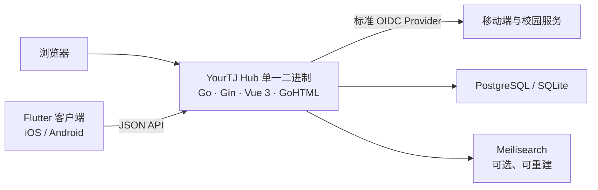

<p align="center">
  <picture>
    <source media="(prefers-color-scheme: dark)" srcset="./assets/brand-default-dark.webp">
    
  </picture>
</p>

<p align="center">
  面向同济校园的社区平台，以论坛沉淀长期有价值的信息与讨论。<br>
  <sub>A community platform for Tongji University, built around durable, searchable conversations.</sub>
</p>

<p align="center">
  <a href="https://github.com/YourTongji/YourTJ-Hub/actions/workflows/ci.yml"></a>
  <a href="https://github.com/YourTongji/YourTJ-Hub/releases"></a>
</p>

<p align="center">
  <a href="https://yourtj.de">官网</a> ·
  <a href="https://f.yourtj.de">网页版</a> ·
  <a href="https://yourtj.de/#download">下载 App</a> ·
  <a href="./docs/README.md">项目文档</a> ·
  <a href="https://github.com/YourTongji/YourTJ-Hub/issues/new?template=bug-report.yml">报告问题</a> ·
  <a href="https://github.com/YourTongji/YourTJ-Hub/issues/new?template=feature-request.yml">功能建议</a> ·
  <a href="./CONTRIBUTING.md">贡献指南</a>
</p>

## 下载与使用

YourTJ 移动端 App 已正式发布，支持在手机和平板上浏览社区、查看课程评价、规划课表和阅读校园 Wiki。
提供简体中文、英语、日语、德语界面及深浅色外观。

| 平台 | 入口 |
|---|---|
| iPhone / iPad | [App Store 下载](https://apps.apple.com/cn/app/yourtj/id6809457637) |
| Android | [下载正式 APK（ARM64）](https://github.com/YourTongji/YourTJ-Hub/releases/download/mobile-latest/YourTJ-arm64-v8a.apk) · [其他架构与发布说明](https://github.com/YourTongji/YourTJ-Hub/releases/tag/mobile-latest) |
| Web | [打开网页版](https://f.yourtj.de) |

统一下载入口见 [yourtj.de](https://yourtj.de/#download)。具体移动端能力与设备验证边界见
[移动端体验](./docs/product/mobile-experience.md#distribution-and-updates)。

## 关于项目

YourTJ Hub 希望让校园经验、问题与观点不再消失在短暂的信息流中。项目以板块化论坛为核心，
提供搜索、统一身份、内容治理和多端访问，以及课程目录与课评、排课器、Wiki 和私密校园工作台。

核心论坛直接演进自 [GooseForum](https://github.com/YourTongji/YourTJ-Hub/tree/main/apps/gooseforum)（fork 自上游
[leancodebox/GooseForum](https://github.com/leancodebox/GooseForum)），保留 Go 后端、Vue 前端
与 GoHTML 模板打包进同一个可执行文件的部署方式。这里不是对上游的薄包装：产品、认证、搜索、
数据、移动端与运维能力都在本仓库中持续演进，同时保留可合并上游更新的代码结构。

> 本项目仍在积极开发。下表中的 `Current`、`Partial`、`Planned` 是严格的实现状态，定义与完整缺口
> 见[当前状态](./docs/product/current-state.md)。

## 能力状态

| 领域 | 状态 | 当前能力 |
|---|---|---|
| 论坛 | `Current` | 主题与回复、板块、通知、私信、草稿、Markdown、RBAC 管理与多语言界面 |
| 身份与安全 | `Partial` | 密码、GitHub／可选 Google OAuth、同济统一认证、内建 OIDC Provider、TOTP 2FA 与可撤销会话；外部登录的 MFA 策略仍待确定 |
| 搜索 | `Partial` | Meilisearch 聚合搜索、拼音匹配、事件驱动索引与 Wiki 段落级局内搜索；搜索服务为可选依赖，Wiki 搜索不可用时保留阅读能力 |
| 数据与文件 | `Current` | 部署默认 PostgreSQL，本地开发 SQLite；文件可存于 SQLite BLOB 或 S3 兼容对象存储 |
| 内容治理 | `Current` | 敏感词审核、限流与验证码、审计、服务条款、数据导入导出 |
| 课程与排课 | `Current` | Web／Flutter 课程目录、课评、收藏与多方案排课；能力边界见[课程规范](./docs/product/courses-and-scheduling.md) |
| Wiki | `Current` | GitHub 内容同步、只读页面与站内评论，编辑和历史外链至源仓库 |
| 我的校园 | `Partial` | Web／Flutter 官方身份连接、课表、学业记录与消息；设备快照和桌面小组件已实现，真机认证及部分上游数据仍待验证 |
| 移动端页面与正式分发 | `Current` | Flutter 原生客户端，中英日德四语言、社区／课程／排课／Wiki；iPhone／iPad 已上架 App Store，Android 提供正式 APK |
| 原生推送与设备验收 | `Partial` | APNs／JPush／OEM 投递、签名升级与校园小组件的真机矩阵仍需逐版本验证；见[移动端边界](./docs/product/current-state.md) |
| API 契约 | `Partial` | OpenAPI 校验、TypeScript 生成与契约测试已落地，全部非排除 `/api` 路由已纳管并有 CI 门禁；OIDC 标准端点与自动 Dart 生成尚未覆盖 |
| 积分 | `Partial` | 论坛内积分账本已落地（发帖/回复奖励幂等入账、删除原子回滚）；跨服务结算（credit）仍未实现 |

## 架构


```mermaid
flowchart LR
    Browser["浏览器"] --> Hub["YourTJ Hub 单一二进制<br/>Go · Gin · Vue 3 · GoHTML"]
    Mobile["Flutter 客户端<br/>iOS / Android"] -->|JSON API| Hub
    Hub -->|标准 OIDC Provider| Clients["移动端与校园服务"]
    Hub --> DB["PostgreSQL / SQLite"]
    Hub --> Search["Meilisearch<br/>可选、可重建"]
```

项目遵循四个重要约束：

- **单一二进制**：Vue 构建产物与 GoHTML 模板通过 `go:embed` 进入 Go 可执行文件，生产环境不拆分前后端。
- **数据库是真相源**：搜索索引、缓存和计数都是可重建投影，不承载唯一业务事实。
- **身份可互操作**：论坛 `users` 表是身份真相源，内建 OIDC Provider 对外签发数值型 `sub`。
- **上游可同步**：`apps/gooseforum` 保留 GooseForum 的主要分层；Go module 路径为本仓库地址，
  合并上游后需重写其 import 前缀（见 `AGENTS.md`）。

详细的领域边界、关键数据流和契约规则见[系统架构](./docs/architecture/system-overview.md)。

## 技术栈

| 范围 | 技术 |
|---|---|
| 后端 | Go 1.26、Gin、GORM、Cobra |
| Web | Vue 3、TypeScript、Vite、Tailwind CSS、GoHTML |
| Mobile | Flutter、Dart、Melos、Riverpod |
| 数据 | PostgreSQL、SQLite、Meilisearch |
| 身份 | 内建 OIDC Provider、GitHub OAuth、JWT、TOTP |
| 交付 | `go:embed` 单一二进制、Docker Compose、GitHub Actions |

## 快速开始

先按[本地开发指南](./docs/development/local-development.md#dependencies)准备 Go、Node.js 与 pnpm。
运行 PostgreSQL 或 Meilisearch 等可选本地依赖时还需要 Docker Compose。

```bash
git clone --branch dev https://github.com/YourTongji/YourTJ-Hub.git
cd YourTJ-Hub

cd apps/gooseforum/resource
pnpm install --frozen-lockfile
cd ../../..

# 生成本地配置（已有 config.toml 时不会覆盖），不启动服务器
(cd apps/gooseforum && go run . --help)
```

将 `apps/gooseforum/config.toml` 中 `[app]` 的 `env` 改为 `"local"`（生成模板默认是
`"production"`），再分别启动后端与前端开发服务器：

```bash
# Terminal 1 — Go backend，默认 http://localhost:5234
make server

# Terminal 2 — Vite 资源服务（:3010）；浏览器打开 http://localhost:5234
make web
```

论坛默认使用 SQLite；上述本地模式启用 Vite 资源代理和本地 HTTP 会话。如需搜索、
PostgreSQL 与其他本地依赖，可先运行：

```bash
make dev
```

构建生产形态的单一二进制：

```bash
make build
# output: bin/yourtj-hub
```

不要提交 `config.toml`，其中包含签名密钥和第三方服务凭据。完整配置、服务地址与移动端启动方式
见[本地开发指南](./docs/development/local-development.md)。

## 仓库结构

```text
apps/
  gooseforum/       Go + Vue 论坛，前端最终嵌入后端二进制
  mobile/           Flutter / Melos 移动端工作区
  status/           独立 Vue 状态站，部署到 Netlify
packages/
  api-contract/     OpenAPI、fixtures 与生成脚本
services/           Meilisearch、积分等服务配置
deploy/             容器、环境与发布脚本
docs/               产品、架构、开发和运维文档
```

业务逻辑、数据访问和 HTTP 层分别位于 `apps/gooseforum/app/service`、`app/models` 与
`app/http/controllers`。完整边界规则见 [`AGENTS.md`](./AGENTS.md)。

## Agent Skills

项目级 Agent Skill 位于 `.agents/skills/`，可在请求中显式引用：

- `$forum-ai-readable-content`：按需使用论坛公开的 `/llms.txt`、`/llms-full.txt`、`/p/posts/{id}.md`
  和经用户明确授权的 `/api/v1/agent` Agent Bot API，用于主题总结、内容审计、跨主题比较、事实提取、追问生成、
  证据化问答以及受控的 Agent 读写操作。Skill 不绕过 `404`、权限、审核、删除或限流边界；Agent token 只能通过
  宿主的安全凭据机制使用，不能写入普通回答；全文导出出现截断时必须标注覆盖不完整。可复制命令见
  `.agents/skills/forum-ai-readable-content/examples.md`；其中的 `scripts/` 仅使用 Python 标准库，默认只读，
  不接受命令行 token，也不实现 Webhook 发送或权限绕过。
- `$yourtj-development`：从现状与调研、用户故事和验收标准出发，统一实现、文档、测试和 PR 交付。
- `$repo-review` / `$yourtj-code-review`：检查产品依据、验收证据及契约、迁移、安全和测试等工程风险。
  Issue/PR 的统一要求见[需求与评审规范](./docs/development/pull-requests.md)。

使用 AI 可读内容 Skill 时，匿名请求优先从索引定位主题，再按需读取单篇 Markdown；不要默认抓取全文或扩散无关的
个人信息。需要 Agent API 时，必须同时核对 Bearer Token、响应 envelope、写入限流和 Webhook 当前未实现边界。
公开导出规则的维护事实源是 `apps/gooseforum/app/service/llmsservice/`、相关 HTTP 路由测试和
`docs/architecture/contracts-and-data.md`；Agent Bot 规则的维护事实源是 `agentservice`、Agent 路由/契约测试、
`packages/api-contract/paths/agent.yaml` 和 `docs/product/identity-and-access.md`。

## 文档

[`docs/README.md`](./docs/README.md) 是唯一文档入口，并说明不同事实应以何处为准：

- [产品愿景与原则](./docs/product/vision-and-principles.md)
- [当前状态与缺口](./docs/product/current-state.md)
- [论坛体验](./docs/product/forum.md)
- [课程与排课](./docs/product/courses-and-scheduling.md)
- [移动端体验与分发状态](./docs/product/mobile-experience.md)
- [系统架构与领域边界](./docs/architecture/system-overview.md)
- [本地开发](./docs/development/local-development.md)
- [测试策略](./docs/development/testing.md)
- [部署与发布](./docs/operations/deployment.md)
- [移动端签名与发布](./docs/operations/mobile-releases.md)
- [Oryn 仓库维护机器人](./docs/operations/oryn.md)（Current：已接入 GitHub App 与仓库 Actions）

## 参与贡献

问题反馈、功能建议和 Pull Request 都很重要。较大的改动建议先通过
[Issue](https://github.com/YourTongji/YourTJ-Hub/issues) 对齐问题、用户与验收标准。

开始编码前请：

1. 阅读 [`AGENTS.md`](./AGENTS.md)、[开发入口](./docs/development/README.md)及需求直接影响的文档；
2. 从最新 `origin/dev` 创建 `feat/*`、`fix/*` 或 `docs/*` 分支，Pull Request 目标为 `dev`；
3. 保持实现、契约、测试与文档同步，并报告实际运行的验证命令。

常用验证命令：

```bash
make test
make build
git diff --check
```

更细的分支约定、CI 对应关系与测试范围见
[Pull Request 指南](./docs/development/pull-requests.md)和[测试策略](./docs/development/testing.md)。

## 许可与致谢

`apps/gooseforum` 基于 GooseForum 修改并保留其
[MIT License](./apps/gooseforum/LICENSE)。感谢 GooseForum 作者和所有上游贡献者提供的坚实基础。

本 monorepo 目前尚未提供覆盖全部目录的根级许可证。在维护者明确整体授权方式前，不应假定
`apps/gooseforum` 之外的内容自动适用 MIT 许可。
