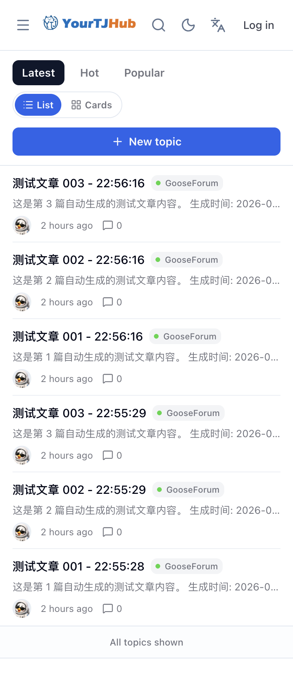

<div align="center">
  
  <h1>GooseForum</h1>
  <p>🚀 Modern Go + Vue 3 Forum System</p>

  <p>
    <a href="https://github.com/YourTongji/YourTJ-Hub/releases"></a>
    <a href="https://github.com/avelino/awesome-go"></a>
    <a href="https://golang.org"></a>
    <a href="https://tailwindcss.com"></a>
    <a href="LICENSE"></a>
    <a href="https://github.com/YourTongji/YourTJ-Hub/stargazers"></a>
  </p>

  <p><a href="README_ZH.md">中文</a> | <a href="README.md">English</a></p>
</div>

> **Note**: this directory hosts the GooseForum fork inside the [YourTJ Hub](https://github.com/YourTongji/YourTJ-Hub) monorepo. It keeps the "Go + Vue in one binary" deployment shape while product, auth, search, data, mobile, and operations capabilities continuously evolve beyond upstream.



## Quick Start

### Download and Run

Download the latest prebuilt binary from [GitHub Releases](https://github.com/YourTongji/YourTJ-Hub/releases), then start it:

```bash
tar -zxvf yourtj-hub_*.tar.gz
chmod +x ./yourtj-hub
./yourtj-hub serve
```

Open `http://localhost:5234`. The first registered user automatically becomes the administrator.

### Build from Source

Requirements:

- Go 1.26+
- Node.js 18+
- pnpm

```bash
git clone https://github.com/YourTongji/YourTJ-Hub.git
cd YourTJ-Hub/apps/gooseforum

cd resource && pnpm install && pnpm build && cd ..
go mod tidy
go build -ldflags="-w -s" .

./gooseforum serve
```

Or from the monorepo root: `make build` produces the single binary at `bin/yourtj-hub`.

### Configuration

GooseForum creates `config.toml` on first startup. The default database is SQLite.

```toml
[app]
env = "production"

[server]
port = 5234
url = "http://localhost"

[db.default]
connection = "sqlite"
path = "./storage/database/sqlite.db"
```

See [configuration documentation](docs/user/configuration.md) for MySQL, PostgreSQL, mail, backup, security, and site settings.

### Admin Commands

```bash
./gooseforum set-user-admin <userId>
./gooseforum set-user-email <userId> <email>
./gooseforum set-user-password <userId> <password>
```

## What Is GooseForum?

GooseForum is a technical community platform built with Go, Gin, GORM, Vue 3, TypeScript, Vite, and TailwindCSS. It ships as a single executable, supports SQLite/MySQL/PostgreSQL, and provides a payload-driven SPA experience with server-rendered fallback pages for SEO and no-js access.

## Features

- Markdown topics, replies, categories, notifications, chat, drafts, and user profiles.
- Role and permission management with a full admin console.
- Responsive public UI for desktop and mobile.
- Theme workbench for light/dark theme preview and publishing.
- SQLite by default, optional MySQL/PostgreSQL, scheduled backups.
- Payload-driven navigation with no-js GoHTML templates.
- Brand customization for logo, text, footer, and site assets.

## Development

```bash
# Backend with hot reload
air

# Public site and admin console
cd resource && pnpm dev
```

The admin console is served by the same Vue app under `/admin`; it does not require a separate frontend service.

## Project Structure

```text
GooseForum/
├── app/                    # Backend code
│   ├── console/            # CLI commands
│   ├── http/               # Controllers, middleware, routes
│   ├── models/             # GORM models
│   └── service/            # Business services
├── resource/               # Vue 3 frontend, templates, static assets
│   ├── src/site/           # Public site
│   ├── src/admin/          # Admin console
│   ├── src/runtime/        # Payload runtime and shared browser helpers
│   └── templates/          # GoHTML fallback templates
├── docs/                   # Documentation
├── main.go
└── config.toml
```

## Deployment Notes

For production, place GooseForum behind a reverse proxy such as Nginx or Caddy, enable HTTPS, and configure database backups.

Minimal container image:

```dockerfile
FROM alpine:latest
RUN apk --no-cache add ca-certificates
WORKDIR /root/
COPY gooseforum .
CMD ["./gooseforum", "serve"]
```

## Documentation

- [Monorepo docs center](../../docs/README.md)
- [Configuration](docs/user/configuration.md)
- [Frontend Architecture](docs/architecture/resource-frontend.md)
- [UI Specification](docs/frontend/ui-spec.md)
- [中文 README](README_ZH.md)

## License

MIT License. See [LICENSE](LICENSE).
