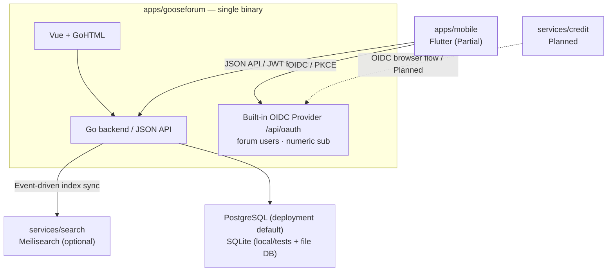

# System Overview & Domain Boundaries

> Doc type: architecture
>
> Status: Active
>
> Owner: Platform maintainers
>
> Last verified: 2026-09-27

## System shape

## Deployment shape

- **Single binary**: forum frontend (Vue 3 output static/dist + GoHTML templates) is fully go:embed'd
  into the Go binary. In development, set `[app] env = "local"` in `config.toml` and browse the
  backend on :5234; it proxies `/assets` to Vite on :3010. Production serves embedded assets. No nginx/CDN split.
- Dependency services (Meilisearch/PostgreSQL) are orchestrated with docker-compose;
  `services/` holds deployment configs only, not third-party source. Deployments default to
  PostgreSQL for the main database; local development and tests default to SQLite.

## Domain boundaries (apps/gooseforum upstream layers)

| Layer | Responsibility |
|---|---|
| `app/console` | cobra CLI (serve / migrate / seed-demo / seed-stickers / mock-topics / mock-posts / rebuild-search-index / migrate-files ...) |
| `app/bundles` | Utilities (connect/eventbus/jwtopt/i18n/captcha/logging/cache ...) |
| `app/models` | GORM models + migrations (app/migration) |
| `app/service` | Business logic (users/topics/mail/oauth/theme/wikiservice ...) |
| `app/http/controllers/api` | JSON API (auth/topic/user/admin/chat/notification/file ...) |
| `app/http/controllers/forum` | Page rendering (GoHTML three-mode: payload + render + SEO) |
| `app/http/middleware` | JWT auth, access log, maintenance mode, unified security response headers (`X-Content-Type-Options`, `X-Frame-Options`, `Referrer-Policy`, `Permissions-Policy`; page CSP on HTML routes, issue #407), rate limiting (per-action, IP+user, 429 + Retry-After) ... |
| `resource/` | Vue 3 frontend (site/admin dual entry) + templates (gohtml) + static (badges/pic) |

**Boundary rules**
- Business logic in `service`; data access in `models`/repository layer; HTTP in `http/controllers`.
- Cross-domain access (e.g. forum→notifications) goes through the owner's public service API; no
  foreign SQL.
- Frontend output only via `resource/static/dist` (go:embed). For OpenAPI-covered operations, consume
  generated types rather than duplicating backend DTOs by hand; maintain other endpoint contracts manually
  until they are covered.
- Upstream sync: `git merge` upstream main; resolve conflicts with "our changes win" and record it.

## Key flows

### Auth

- Web: password login (optional forum-side TOTP 2FA), GitHub OAuth (goth, config [github]), optional
  Google OAuth (goth, config [google]), Tongji SSO (campus credentials and callback), and the
  built-in OIDC Provider (authorization code + PKCE S256, numeric `sub` = users.id) for first-party
  clients. Sessions are `jti` + `user_sessions` backed and revocable (see identity-and-access.md).
- Mobile (`Partial`): appauth+PKCE → id_token → `POST /api/auth/oidc/exchange` → forum JWT. The
  Flutter shell and feature pages consume the repository-owned `Gf*` UI API. `ui_kit` composes
  Flutter primitives with shared semantic tokens and native interaction behavior; component shapes,
  focus, selected/disabled states and touch targets are owned by the repository
  ([0039](../decisions/0039-native-gf-component-foundation.md)).

### Foreground chat and notification changes (Current)

- The Go forum publishes owner-scoped chat, notification and unread invalidations to a bounded,
  process-local SSE hub after committed writes. `GET /api/forum/events` authenticates the forum
  session, sends `hello` with `resync: true`, heartbeats and bounded change hints. The stream has no
  durable replay cursor or message body; REST remains the source of content and unread counts.
- The Flutter shell owns one stream while foregrounded. It cancels the connection on background or
  session invalidation, fences pending callbacks by session, and uses the `hello` frame to refresh
  open message/notification views and unread badges. Chat views stop their 15-second polling while
  the stream is healthy. On disconnect or an unsupported endpoint they resume polling in the
  foreground; reconnect performs another REST reconciliation. Expected HTTP cancellation during
  decoder shutdown completes silently; other transport errors still trigger reconciliation and retry.
- This process-local delivery assumes the forum's single-instance deployment shape. A multi-instance
  deployment would need shared fan-out before treating SSE as a reliable cross-instance hint channel.

### Search (Partial)

- Meilisearch optionally enabled (config [meilisearch]). Aggregate search (one box covering
  topics/users/categories with scope tabs; pinyin/initials matching for users and categories) landed
  in issue #22. Index sync is event-driven (topic/user/category events) through `task_queue` outbox
  rows. Main topic/category/wiki writes enqueue in their transaction; post-commit user/profile and
  lifecycle events enqueue asynchronously. Workers read the latest committed database state, use a
  lease and retry/recovery path, and keep Meilisearch as a rebuildable projection
  (`rebuild-search-index` CLI).
  When Meilisearch is unavailable the search page shows a full unavailable state; per-index failures
  degrade partially via `failedScopes`.

### Link previews and outbound navigation

- Web and Flutter detect only bare HTTP(S) URLs that occupy a complete Markdown paragraph. They consume
  the same fixture and never persist preview metadata or generated card markup into Markdown.
- `POST /api/link-previews/resolve` classifies configured first-party origins before network access.
  Topic, Course, Wiki and User previews read local public projections; third-party pages pass through a
  bounded HTML fetcher that validates every DNS result and redirect, dials only the checked IP, and caps
  time, redirects, decompressed bytes and concurrency. Cached and singleflight results expose only a
  fixed metadata whitelist.
- Preview cards are progressive enhancement: a timeout, policy rejection or unsupported page leaves the
  original link intact. All UGC external links use one per-client guard that displays the canonical
  hostname and complete URL. Session trust is keyed by Public Suffix List eTLD+1 and never applies to a
  suspicious or blocked risk state.

### Async boundaries and consistency

- A request-scoped database, HTTP, or LLM operation receives the incoming request context and must
  stop on cancellation/deadline. Post-commit notifications use the explicit
  `eventbus.DetachedContext` boundary, while workers receive their own lifetime context; legacy
  synchronous wrappers retain bounded timeouts for compatibility.
- Admin JSON import is accepted only up to 50 MiB, staged as an owner-readable (`0600`) file, and
  represented by a deduplicated `import` task. The worker validates the SHA-256 payload and applies
  all rows plus invariant rebuilding in one database transaction; failures retain the staging file
  and can be replayed from the admin task endpoint.
- Course AI summary remains synchronous at the public API boundary for wire compatibility, but the
  provider call is cancellable and capped at 30 seconds. Database caching and rate limits remain the
  cost and duplicate-generation guard; moving this API to an asynchronous response is a separate
  contract change.
- Topic-list cache invalidation is keyed to the changed category set; the cache is process-local.
  Redis or another shared cache is deliberately deferred until deployment has a measured
  multi-instance requirement and an explicit rollback plan.

### Wiki 分站 (Current)

Wiki 内容由公开 GitHub 仓库 `YourTongji/YourTJ-Wiki` 维护（PR 协作编辑/审核/历史/贡献者），
论坛为只读投影（GitHub 唯一真实源，SSOT）。旧 VitePress 静态站与站内写模型已废弃。

- **后端分层**: `app/models/forum/wikiNamespaces` / `wikiPages` / `wikiSyncRuns` →
  `app/service/wikiservice`（同步引擎 `sync.go`：`clone --depth=1` + `fetch` + `reset --hard`、
  幂等投影；**Git 重命名/移动文件按 `content_hash` 唯一匹配收养原页面行，复用 topic 与全部互动**，
  歧义/内容同时变化时 fail-safe 新建+软删旧页，issue #288）→
  frontmatter 解析、sha256 幂等 diff、upsert/软删/恢复、贡献者快照；查询 `query.go`：
  BuildTree/BuildHome/贡献者；树以仓库路径递归投影目录节点（目录可无 `index.md`），同步结束后
  将 `parent_id` 重算为最近祖先 `index.md` 页面；管理：命名空间 CRUD + 只读树）→ controllers：
  `app/http/controllers/forum/wiki.go`（SSR，PageComponent `wiki.home`/`wiki.detail`）+
  `app/http/controllers/api/wikiController.go`（公开读 + `/api/admin/wiki/*` 管理端）+
  `wikiSyncController.go`（`/api/wiki/webhook` + `/api/admin/wiki/sync*`）。
- **同步触发**: 每日定时（`[wiki.git].schedule`，默认 `0 3 * * *`）+ 管理端
  `/admin/wiki` 同步面板手动触发 + GitHub webhook（`POST /api/wiki/webhook`，HMAC-SHA256
  验签，push 事件，仅默认分支）。同步运行写入 `wiki_sync_runs`
  （trigger/status/head_sha/变更计数/错误）。
- **路由**: `GET /wiki`、`GET /wiki/*path`（SSR 服务端渲染）；`/wiki/_assets/*path`
  由同一 catch-all 分派并仅从当前仓库 clone 提供已验证的非 Markdown 资源；公开 API
  `GET /api/wiki/{tree,namespaces,home}` + `POST /api/wiki/webhook`；管理端
  `/api/admin/wiki/*`（PageManager：namespaces CRUD、只读树、`sync/status` /
  `sync` / `sync/runs`）。站内写/回滚/diff/编辑者/版本历史端点已退役。
- **前端**: site 区 `WikiHome.vue` / `WikiPage.vue` + `WikiSidebar` / `WikiToc` /
  `WikiPageActions`（编辑/历史按钮外链 GitHub），AppShell 侧栏 wiki 模式（桌面侧栏与
  移动端抽屉均渲染完整 wiki 导航树）；admin 区
  `WikiManage.vue`（`/admin/wiki`，PageManager：命名空间 + 递归只读页面树 + 同步面板）。
- **隔离与通知**: `topics.topic_type`（0=论坛 1=wiki）隔离 feed 与搜索——默认论坛搜索/feed/RSS/
  sitemap 排除 wiki 话题（TopicSearchDocument 带 topicType）；同步更新后向订阅者发
  `wiki_updated` 通知（`notifications.templates.wikiUpdated`，同页面 10 分钟节流）。
- **契约**: OpenAPI wiki 域覆盖公开读 + 管理同步端点 + webhook（`paths/wiki.yaml` +
  `paths/wiki-sync.yaml`），生成 TS 类型 + 手写 Dart mirror
  （`apps/mobile/packages/core/lib/src/gen/wiki.dart`）。

### Independent public status application (Current)

`apps/status` is a separate Vue/Vite application on Cloudflare Workers Static Assets. The forum
only links to `https://status.yourtj.de`; page delivery and collection do not require the forum API,
database or runtime assets. GitHub Actions collectors read public Umami, one Komari node and the
independent Uptime Kuma status page. An optional server-only Umami account reads joint device/OS/client
aggregates; only allowlisted categories and counts reach the public Sankey chart.

Snapshots persist in a private R2 bucket shared across production deployments. Preview uses a separate
bucket and has no automatic schedules. Conditional writes prevent older collectors overwriting newer
snapshots. Collection preassembles range views; the API reads at most one public view and one device
object, checking source scope fingerprints and original timestamps. Dynamic responses are no-store
and do not enter the edge cache. Static assets bypass the Worker handler.

Current metrics and history/traffic are collected every fifteen minutes; devices hourly. Worker has no
collection schedules or upstream credentials. Source timestamps, independent freshness and bounded retention remain authoritative even
between successful browser polls. Main-branch deployment runs only for status-related input changes and after
status checks succeed. See the [status specification](../product/server-status.md),
[Cloudflare runbook](../operations/status-cloudflare.md) and
[hosting decision](../decisions/0057-status-cloudflare.md).

### Points

`Current`: the forum owns a local idempotent reward ledger. `Partial`: reward delivery still uses
in-memory events without durable reconciliation. `Planned`: credit is a separate OIDC client and
settlement ledger; the forum would call its merchant distribution API. See the
[points specification](../product/credit-and-escrow.md).

## Consistency principles

- The chosen DB is the business fact source; search, cache, counters, hot lists, and feeds are
  rebuildable projections.
- Critical side effects (notifications, index sync, points distribution) are idempotent, retryable,
  observable.
- The transaction outbox is the reliability seam for this single-binary deployment; adding a broker
  is not implied by the current architecture. Connection-pool sizing and query-cache/projection
  changes require measurements from the target PostgreSQL deployment (CPU, concurrency, p95 latency,
  and memory) before changing defaults.
- For OpenAPI-covered operations, contract changes ship in the same PR: Go behavior/struct →
  `openapi.yaml` → generated TypeScript output → fixture tests. Dart generation remains Planned.

## Private campus connection

`Current`: `campusservice` owns school OAuth and typed presentation projections; `models/forum/campus` owns the encrypted binding and unique identity reservation. Campus data and binding controllers authenticate the forum session, enforce CSRF/writable-account gates and return no-store responses. The shared school callback dispatches login-purpose state to browser-bound authentication, preserving the original session requirements for binding-purpose state. School sign-in reuses the unique campus relation, with activated-account creation and campus binding committed atomically through the account owner APIs. Vue `/campus` and the native Flutter campus pages share the same API and retain the single binary deployment. School records are request-scoped; only credentials are encrypted in the primary database. See [campus product semantics](../product/campus.md) and [operations](../operations/campus.md).

`Current`: `calendaradjustment` validates administrator-confirmed holiday and teaching-date
rules, persisted through `pageConfig`'s compare-and-swap API. It drafts public notices through
`aiservice.SummaryConfig`, sharing the summary provider configuration and quota. `campusservice`
applies confirmed rules to original dated occurrences before emitting ICS; source teaching
weeks and stable event identities are preserved. Both clients explicitly choose whether to
apply rules. The LLM does not receive private timetables.
